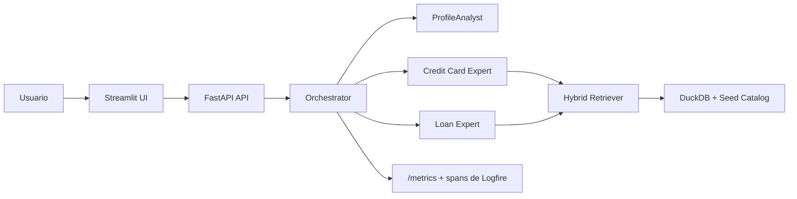

# FinSage LATAM

FinSage LATAM es un sistema de recomendacion financiera AI-first construido como proyecto de portfolio para demostrar algo muy concreto: puedo tomar un stack pedido en vacantes modernas de AI Engineering, convertirlo en un producto funcional y dejarlo desplegable, medible y auditable.

No es un chatbot generico. Es una demo de toma de decisiones financieras con agentes especializados, structured outputs, retrieval, evals y una interfaz publica lista para mostrar en entrevistas, PRs tecnicas o una publicacion en LinkedIn.

## Por que llama la atencion

- Replica un stack real de AI product engineering en lugar de una demo trivial de chat.
- Cada recomendacion queda respaldada por payloads estructurados y reasoning trace auditable.
- Incluye API, UI, eval harness, metricas visibles, Docker y despliegue listo para Railway.

## Features

- `Orquestacion multi-agente`: enruta consultas hacia expertos de tarjetas y prestamos.
- `Structured outputs`: toda llamada relevante valida contra schemas Pydantic.
- `Retrieval hibrido`: prepara catalogo seed de productos reales de Chile sobre DuckDB.
- `API con FastAPI`: expone `/recommend`, `/health` y `/metrics`.
- `UI con Streamlit`: demo conversacional con telemetria visible en sidebar.
- `Evals`: mide intent accuracy, recall@3 y scoring por rubrica.
- `Modo demo free tier`: la ruta principal usa Gemini API y Gemini embeddings con una sola clave server-side.
- `Deploy listo`: incluye `Dockerfile`, `docker-compose.yml`, `railway.toml` y launcher dedicado.

## Casos de uso cubiertos

La demo ya esta pensada para consultas concretas y tambien para consultas ambiguas donde primero hay que pedir mejores datos. Ejemplos:

1. Elegir una tarjeta con cashback para compras diarias.
2. Elegir una tarjeta para viajes, lounge o millas.
3. Buscar una tarjeta con baja comision anual.
4. Buscar una tarjeta premium segun renta y beneficios.
5. Pedir un prestamo personal para consolidar deudas.
6. Pedir un prestamo para un monto y plazo especificos.
7. Comparar tarjeta versus prestamo personal para una necesidad puntual.
8. Comparar dos productos concretos cuando el usuario los nombre.
9. Guiar al usuario cuando todavia no sabe si necesita tarjeta, prestamo o comparacion.
10. Explicar que datos faltan para recomendar con precision sin inventar una respuesta cerrada.

## Demo

El GIF del demo todavia no esta versionado en este workspace porque no hay una grabacion fresca del flujo completo. Apenas grabes una demo corta, puedes generar el GIF optimizado con:

```bash
mkdir -p assets
ffmpeg -y -i demo-recording.mp4 -vf "fps=12,scale=1440:-1:flags=lanczos,split[s0][s1];[s0]palettegen[p];[s1][p]paletteuse" -loop 0 assets/demo.gif
```

Luego insertalo cerca del inicio de este README con:

```md

```

## Metricas headline

Estas son las 3 metricas que conviene fijar arriba del todo cuando ya corras evals reales:

- `Intent accuracy`: `TBD`
- `Recall@3`: `TBD`
- `Rubric overall`: `TBD / 5`

Se generan con:

```bash
uv run python -m evals.run_evals
```

Este entorno no expone `GEMINI_API_KEY`, asi que no corresponde inventar esos numeros. Apenas corras evals de verdad, copia los resultados desde `evals/reports/eval_report.md` a esta seccion.

## Arquitectura



## Quick start

```bash
uv sync
uv run python -m src.api.main
uv run streamlit run src/ui/app.py
```

Abre:

- API: [http://127.0.0.1:8000/health](http://127.0.0.1:8000/health)
- UI: [http://127.0.0.1:8501](http://127.0.0.1:8501)

`/recommend` requiere `GEMINI_API_KEY`. Si falta, la API responde `503` de forma esperada y `/health` deja visible que el demo todavia no esta listo para recomendar.

## Healthcheck y hardening del demo

El endpoint `/health` no solo responde si el proceso esta vivo. Tambien expone:

- si el demo esta listo para recomendar (`recommendations_ready`)
- que secretos faltan (`missing_env`)
- si CORS esta configurado por allowlist
- el limite maximo de tamano de request
- el modo actual de observabilidad de Logfire

Esto evita que la demo dependa de supuestos ocultos.

## Docker local

```bash
docker compose up --build
```

Esto levanta:

- API en `http://localhost:8000`
- UI en `http://localhost:8501`

## Deploy en Railway

- Config de Railway: [railway.toml](/C:/Users/Usuario/Documents/finsage-latam/railway.toml)
- Imagen Docker: [Dockerfile](/C:/Users/Usuario/Documents/finsage-latam/Dockerfile)
- Launcher: [src/deploy.py](/C:/Users/Usuario/Documents/finsage-latam/src/deploy.py)
- Guia paso a paso para primera vez: [docs/deploy_railway.md](/C:/Users/Usuario/Documents/finsage-latam/docs/deploy_railway.md)

Forma recomendada para portfolio:

- `Un solo servicio`: Streamlit queda publico en `/` y FastAPI corre interno en `127.0.0.1:8000`.
- `Un worker`: mantiene coherentes las metricas in-process del sidebar.
- `Logfire opcional`: hay spans manuales en el flujo critico y el estado real se ve en `/health`.

## Variables de entorno

Usa [.env.example](/C:/Users/Usuario/Documents/finsage-latam/.env.example) como plantilla base.

Obligatorias:

- `GEMINI_API_KEY`

Opcionales:

- `LOGFIRE_TOKEN`
- `FINSAGE_API_URL`
- `FINSAGE_CORS_ALLOW_ORIGINS`
- `FINSAGE_MAX_REQUEST_SIZE_BYTES`
- `FINSAGE_API_HOST`
- `FINSAGE_API_PORT`
- `PORT`

## Demo desplegado

Agrega aqui la URL publica de Railway apenas exista el primer deploy real. Mientras no exista, el estado honesto es `pending`.

Formato sugerido:

```md
[Demo en vivo](https://your-app.up.railway.app)
```

## Stack

- Python 3.11
- Gemini API
- LangGraph
- Pydantic v2
- FastAPI + Uvicorn
- Streamlit
- DuckDB
- Gemini embeddings
- Playwright
- Logfire
- Docker + Railway

## Estructura del proyecto

```text
src/
  agents/     logica de agentes y orquestacion
  api/        entrypoint y endpoints FastAPI
  models/     schemas Pydantic
  rag/        capa de retrieval
  scrapers/   scrapers por banco
  ui/         capa de presentacion Streamlit
evals/        harness y casos de evaluacion
data/seed/    productos seed de Chile v1.0
docs/         ADRs, prompts y guias de deploy
```

## Quality checks

```bash
uv run ruff check .
uv run mypy
uv run pytest
```

## Como posicionarlo en portfolio

Este repo se luce mas cuando lo presentas como una propuesta concreta para roles que mencionan:

- agentic workflows
- retrieval-augmented generation
- evaluacion de modelos
- APIs listas para deploy
- demos publicas con trazabilidad

La historia fuerte no es solo "hice una app", sino "puedo leer un stack pedido en vacantes, construir una propuesta funcional y dejarla lista para ser probada por terceros".

## Checklist de despliegue y publicacion

1. Cargar `GEMINI_API_KEY` en local o en Railway.
2. Verificar `uv run pytest`, `uv run mypy` y `uv run ruff check .`.
3. Levantar localmente y revisar [http://127.0.0.1:8000/health](http://127.0.0.1:8000/health).
4. Confirmar que `recommendations_ready` sea `true`.
5. Hacer `docker compose up --build` y validar UI + API.
6. Desplegar a Railway con la configuracion documentada.
7. Abrir la URL publica y probar un flujo completo desde la UI.
8. Revisar `/health` en deploy para detectar secretos faltantes, CORS o modo de observabilidad.
9. Ejecutar `uv run python -m evals.run_evals` con claves reales y pegar las 3 metricas headline.
10. Grabar una demo corta y generar `assets/demo.gif`.
11. Reemplazar el placeholder de la URL publica en este README.
12. Preparar una publicacion de LinkedIn con: problema, stack, demo, metricas y link en vivo.
